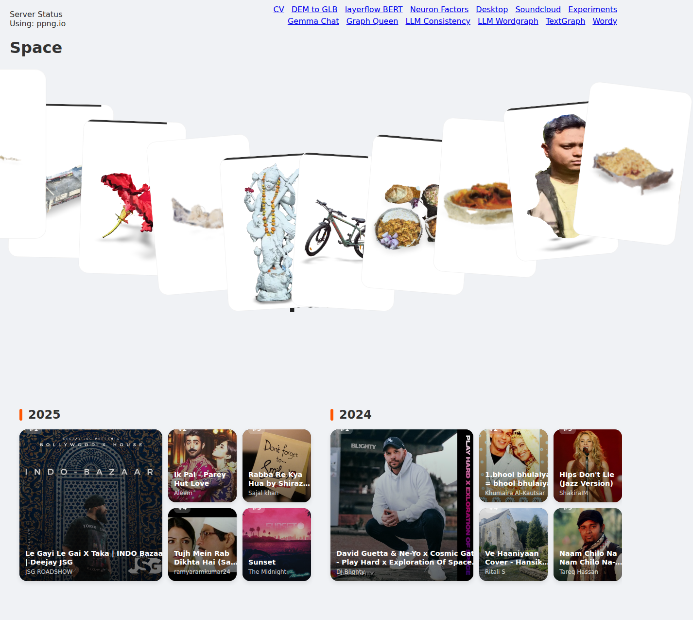
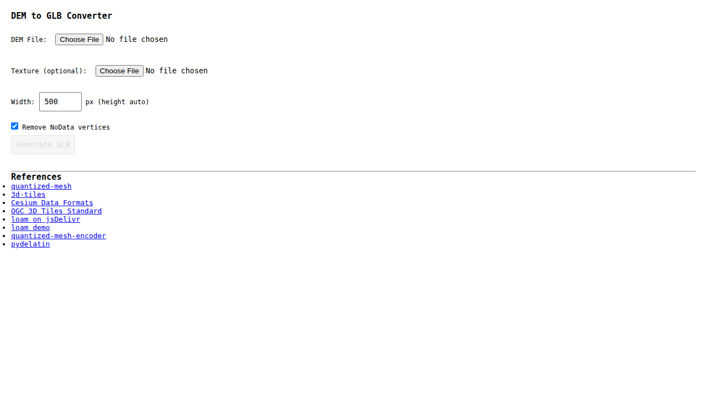

# 1kaiser.github.io

This repository hosts a personal portfolio showcasing a 3D Model Gallery, SoundCloud playback history visualizations, and various AI/ML experiments.

## Acknowledgements

This project leverages several key technologies and AI assistance:

*   <a href="https://developers.google.com/community/jules" target="_blank" rel="noopener noreferrer"></a>
    **AI Development Assistance**: Initial development, refactoring, feature implementation, and debugging significantly aided by Jules (a large language model from Google).

*   <a href="https://modelviewer.dev/" target="_blank" rel="noopener noreferrer">" width="40"></a>
    **[Google `<model-viewer>`](https://modelviewer.dev/)**: For rendering 3D models interactively on the web and enabling AR experiences.

*   <a href="https://threejs.org/" target="_blank" rel="noopener noreferrer"></a>
    **[Three.js](https://threejs.org/)**: The powerful WebGL library used for the 3D Desktop environment and as the foundation for `<model-viewer>`.

*   <a href="https://google.github.io/draco/" target="_blank" rel="noopener noreferrer"></a>
    **[Google Draco](https://google.github.io/draco/)**: For 3D graphics compression, helping reduce the size of the 3D models.

*   <a href="https://vuejs.org/" target="_blank" rel="noopener noreferrer"></a>
    **[Vue.js](https://vuejs.org/)**: The Progressive JavaScript Framework used for building the user interface of the gallery (Vue 3).

*   <a href="https://bulma.io/" target="_blank" rel="noopener noreferrer"></a>
    **[Bulma](https://bulma.io/)**: A modern CSS framework based on Flexbox, used for the DEM to GLB converter interface.

*   <a href="https://d3js.org/" target="_blank" rel="noopener noreferrer"></a>
    **[D3.js](https://d3js.org/)**: Used for repository timeline and various data visualizations.

*   **[Piping Server](https://github.com/nwtgck/piping-server)**: Used to facilitate the real-time transfer of model data for the 'Deploy to Mobile' QR code feature.

## Key Features

*   **3D Model Gallery**:
    *   Interactive display using Google `<model-viewer>`.
    *   **Bento-style layout**: Models are presented in a modern, responsive grid.
    *   **Interactive Loading**: Models load on interaction to optimize performance.
    *   **Modal View**: Detailed view with AR support and download options.
*   **SoundCloud Playback Rewind**:
    *   Visualizes top tracks from SoundCloud in a bento-style grid.
    *   Includes track artwork, titles, and artists with direct links to SoundCloud.
*   **DEM to GLB Converter**:
    *   A tool that converts Digital Elevation Models (TIF/TIFF) into 3D GLB models.
    *   Supports auto-fetching satellite imagery from Google Maps to texture the mesh.
    *   Runs entirely in the browser using `loam` (GDAL in WebAssembly).
*   **3D Desktop Environment**:
    *   An immersive 3D "desktop" experience built with Three.js.
*   **Deploy to Mobile (QR Code)**:
    *   Easily view 3D models on mobile devices in AR.
    *   Uses piping servers for peer-to-peer data transfer.
*   **Repository Timeline**:
    *   A scrollable timeline of GitHub repository history.

## 🚀 Featured Experiments

*   **Wordy**: [Live Demo](https://1kaiser.github.io/wordy/) | [GitHub](https://github.com/1kaiser/wordy)
*   **TextGraph**: [Live Demo](https://1kaiser.github.io/TextGraph/) | [GitHub](https://github.com/1kaiser/TextGraph)
*   **Gemma Chat App**: [Live Demo](https://1kaiser.github.io/gemma-chat-app/) | [GitHub](https://github.com/1kaiser/gemma-chat-app)
*   **LLM Consistency Vis**: [Live Demo](https://1kaiser.github.io/llm-consistency-vis/) | [GitHub](https://github.com/1kaiser/llm-consistency-vis)
*   **Graph Queen**: [Live Demo](https://1kaiser.github.io/graph-queen/) | [GitHub](https://github.com/1kaiser/graph-queen)

## Current Folder Structure

```ascii
.
├── css/
│   ├── styles.css
│   └── soundcloud-integration.css
├── cv/
│   ├── cv.html
│   ├── dem-to-glb.html
│   └── ... (other pages)
├── desktop/
│   ├── desktop.html
│   └── desktop.js
├── js/
│   ├── app.js
│   ├── gallery-vue.js
│   ├── piping-utils.js
│   ├── qr-deploy.js
│   └── soundcloud-integration.js
├── models/
│   ├── models.js
│   └── ... (model files)
├── soundcloud/
│   ├── index.html
│   └── playback_data.json
├── view/ (Mobile View)
│   ├── index.html
│   ├── mobile-view.css
│   └── mobile_view.js
├── experiments.html
├── index.html
└── README.md
```

## TODO

- [X] Upgrade gallery to Vue 3.
- [X] Implement SoundCloud bento-style integration.
- [X] Add DEM to GLB converter.
- [X] Add 3D Desktop environment.
- [ ] Refine mobile responsiveness across all sub-pages.
- [ ] Add more 3D models to the gallery.
- [ ] Implement search functionality for models and experiments.

## Visuals

### SoundCloud Integration



### DEM to GLB Converter

